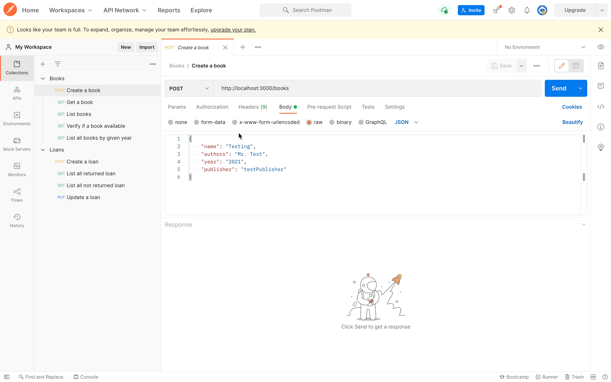
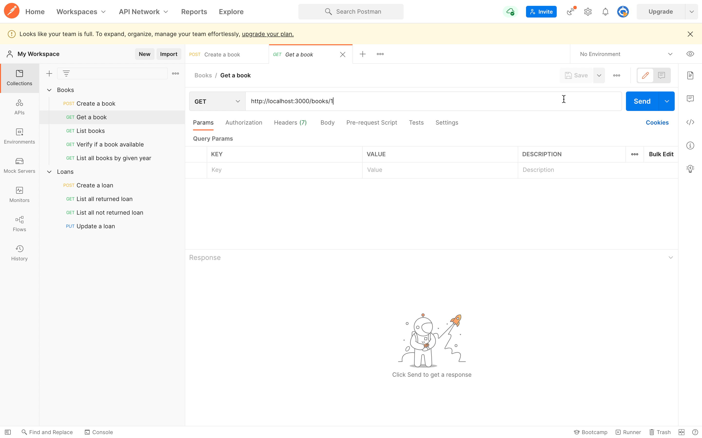
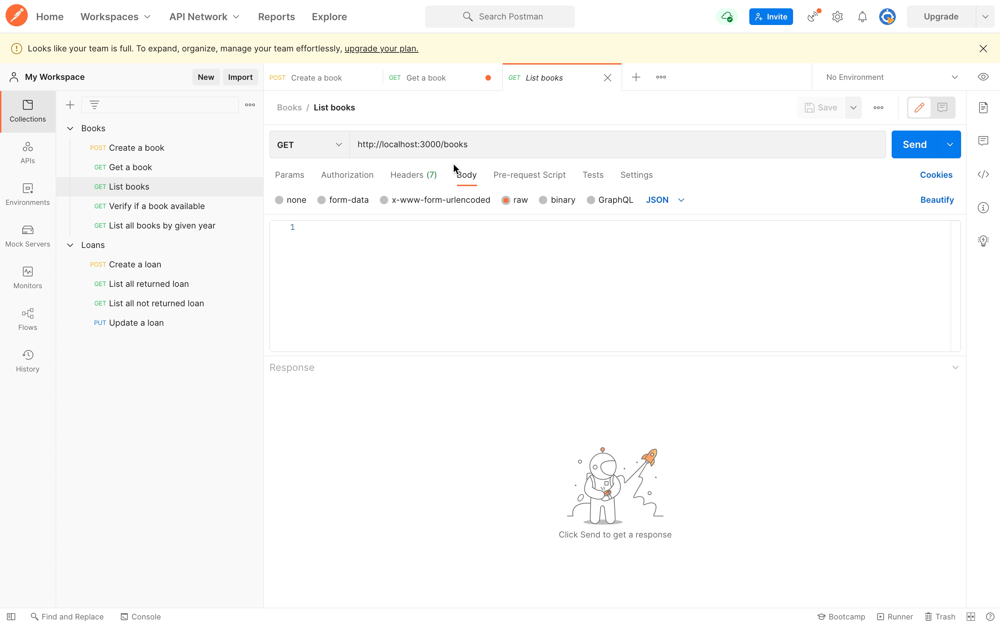
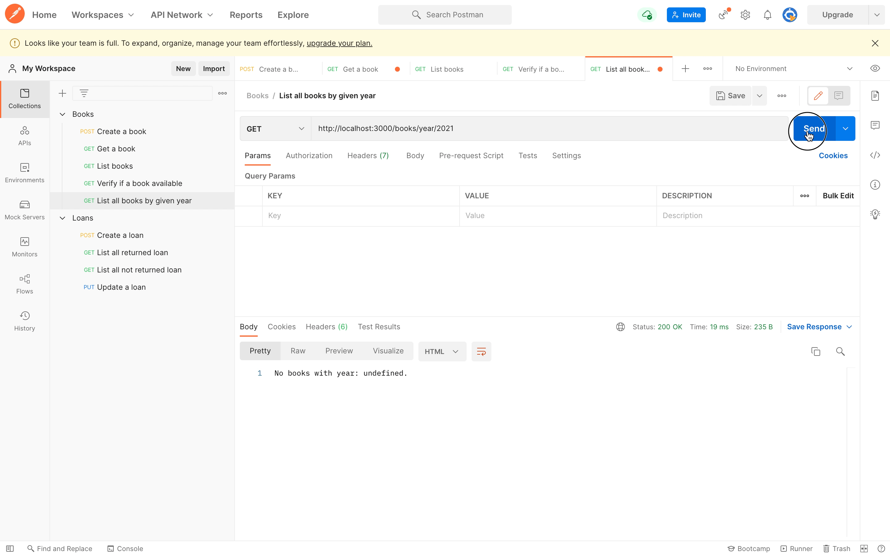
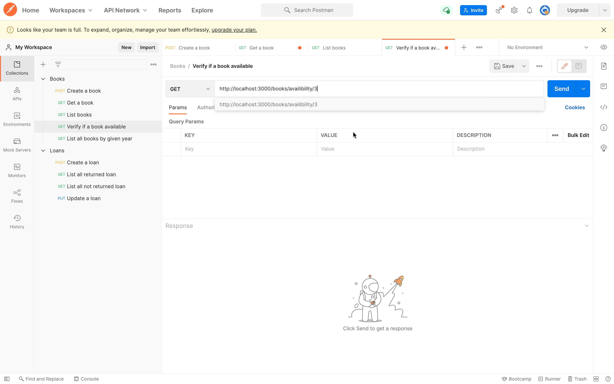
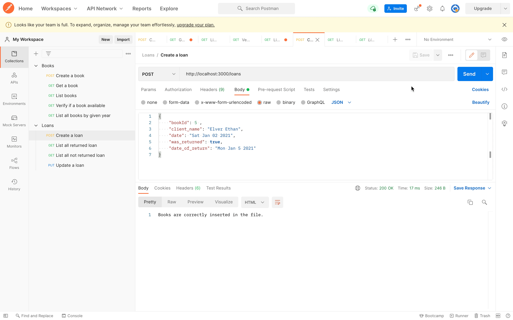
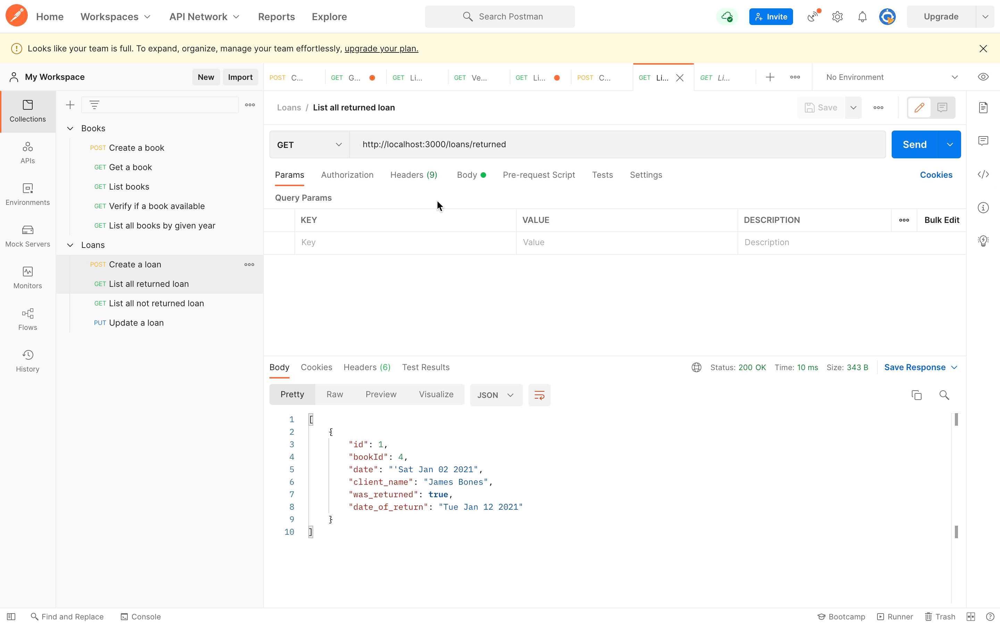
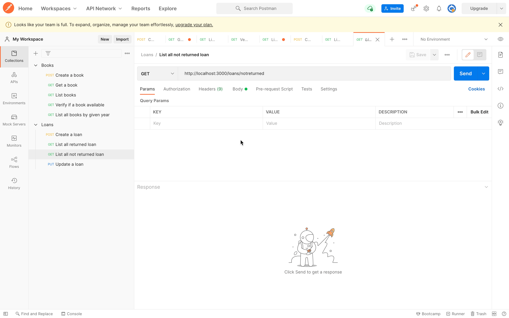

# Book Store App Projects 
In COMP3100 course, I have 3 individual assignments. 
Name As: web_assignment_1, web_assignment_2, and web_assignment_3.

### [web_assignment_1](https://github.com/yeeteing/web_assignment_1)
- Create a REST API for Book and Loan.
- Having a mock JSON data for Books and Loans.

### [web_assignment_2](https://github.com/yeeteing/web_assignment_2)
- Create unit test for the Book API.
- Store the Books data in mongo db.

### [web_assignment_3](https://github.com/yeeteing/web_assignment_3)
- Developed a responsive web page for Library management with JQuery, ajax, HTML, and CSS. 
- The website need to communicate with the server API through ajax.

## web_assignment_1 
Prerequisite: [Node.js(LTS version will be fine) and npm](https://docs.npmjs.com/downloading-and-installing-node-js-and-npm#using-a-node-version-manager-to-install-node-js-and-npm)

## Steps to run:
1. navigate to "web_assignment_1" root folder
2. run `npm install`
3. run `node app.js`

## To communicate with this API (with Demo)
You will need [Postman](https://www.postman.com/downloads/)

#### Here is some example on what params, body,     - url needed for each purpose. 
*!Note! This example run server on port 3000. If you run in different port, make sure you modified the url accordingly!*

### Add a new book. (POST Method)
- url: http://localhost:3000/books
- body example: 
```
{
    "name": "Testing",
    "authors": "Mr. Test",
    "year": "2021",
    "publisher": "testPublisher"
}
```


### Get a book. (GET Method)
 - url: http://localhost:3000/books/{id}



### List all books. (GET Method)
 - url: http://localhost:3000/books



### List all books by a given year (GET Method)
 - url: http://localhost:3000/books/year/{year}



### Verify if a book is available. (GET Method)
 - url: http://localhost:3000/books/availibility/{id}



### Add a loan. (POST Method)
 - url: http://localhost:3000/loans
    - body example:
```
{
    "bookId": 5 ,
    "client_name": "Elver Ethan",
    "date": "Sat Jan 02 2021",
    "was_returned": true,
    "date_of_return": "Mon Jan 5 2021"
}
```


### List all loans that was returned (GET Method)
 - url: http://localhost:3000/loans/returned



### List all loans that was not returned (GET Method)
 - url: http://localhost:3000/loans/noteturned



### Update a loan. This operation should control if the book was returned or not. (PUT Method)
- url: http://localhost:3000/loans/{id}


